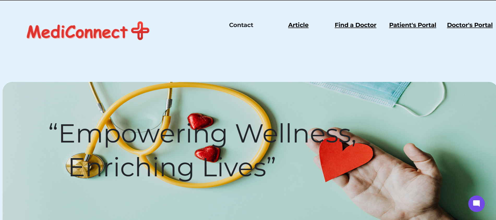
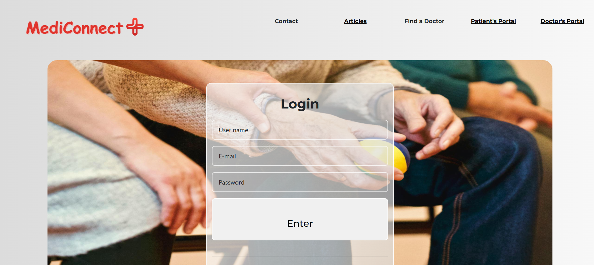
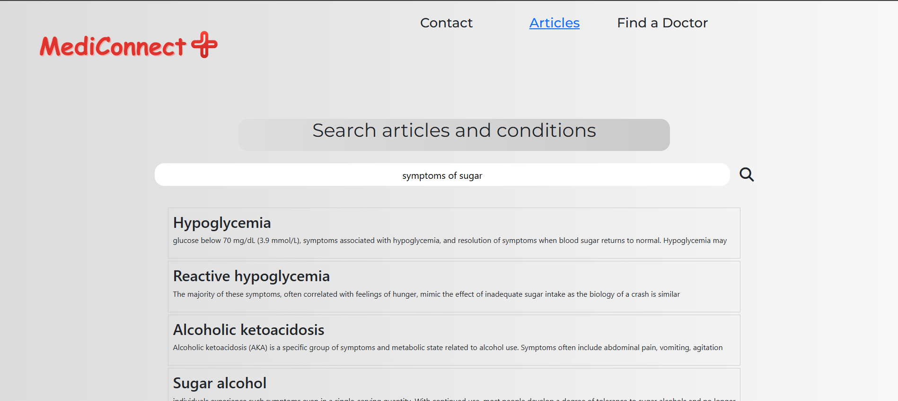
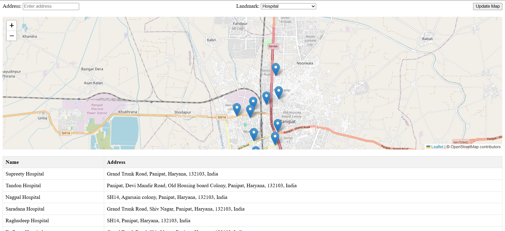
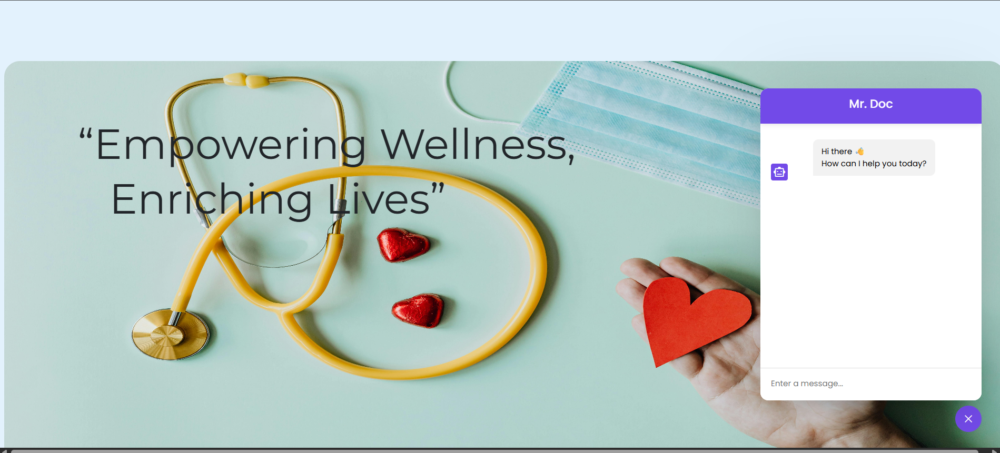

# 🩺 MediConnect

MediConnect is a collaborative full-stack healthcare web application designed to bring multiple healthcare services together on a single platform.

The platform provides separate patient and doctor workflows, secure authentication, doctor discovery, appointment-related functionality, healthcare articles, nearby hospital discovery, real-time communication, and a healthcare chatbot.

---
## 🚀 Live Demo

👉 **[Visit MediConnect](https://mediconnect-44g3.onrender.com/)**

The application is deployed on Render and can be explored through the live demo.

## 🚀 Overview

MediConnect aims to simplify access to common healthcare services through a centralized web platform.

Users can:

- Create and access patient or doctor accounts
- Discover doctors
- Book appointments
- Search healthcare articles and medical conditions
- Explore symptoms and treatment-related information
- Find nearby hospitals and healthcare centres
- Interact with a healthcare chatbot
- Communicate through real-time features
- Access dedicated patient and doctor portals

---

## ✨ Features

### 🏠 Healthcare Platform

- Centralized healthcare services through a single platform.
- Separate workflows for patients and doctors.
- Patient and doctor portals.
- Clean and responsive web interface.
- Easy navigation between healthcare services.

### 🔐 Patient & Doctor Authentication

- Separate authentication flows for patients and doctors.
- JWT-based authentication.
- Password hashing for user credentials.
- Protected routes for authenticated users.
- Role-based access to patient and doctor functionality.

### 👤 Patient Portal

Patients can access a dedicated portal for managing their healthcare activities.

Features include:

- Patient dashboard
- Doctor discovery
- Appointment functionality
- Healthcare information
- Patient-specific services

### 👨‍⚕️ Doctor Portal

Doctors have a dedicated portal for managing their interactions with patients.

Features include:

- Doctor dashboard
- Doctor profile
- Patient-related information
- Appointment management
- Doctor-specific functionality

### 🔎 Doctor Discovery

Users can find doctors through the platform and explore available healthcare professionals.

The platform provides a dedicated doctor discovery workflow for patients looking for medical assistance.

### 📅 Appointment Management

MediConnect provides appointment-related functionality connecting patients and doctors.

The system supports:

- Appointment booking
- Appointment information
- Patient-doctor association
- Protected appointment routes

### 🏥 Nearby Hospitals & Healthcare Centres

MediConnect includes an interactive map-based healthcare discovery feature.

Users can:

- Search for healthcare facilities.
- Enter an address.
- Select a landmark.
- View nearby hospitals and healthcare centres.
- View healthcare facility names and addresses.
- Explore healthcare facilities on an interactive map.

The map interface uses **Leaflet** and **OpenStreetMap**.

### 📚 Healthcare Articles

Users can search and explore healthcare information related to:

- Diseases
- Medical conditions
- Symptoms
- Treatments
- General healthcare topics

The article search interface helps users find relevant healthcare information based on their search.

### 🤖 Healthcare Chatbot

MediConnect includes an interactive chatbot interface for healthcare-related conversations.

Users can:

- Open the chatbot from the application.
- Ask healthcare-related questions.
- Interact through a conversational interface.

> The chatbot is intended for informational purposes and should not replace professional medical advice.

### 💬 Real-Time Communication

The application uses **Socket.IO** to support real-time communication.

The backend provides Socket.IO-based communication for interactive features and WebRTC signaling.

### 📹 Video Consultation Support

The project includes WebRTC signaling functionality for establishing real-time video communication.

The signaling layer supports:

- Room joining
- WebRTC offers
- WebRTC answers
- ICE candidates
- Leaving communication rooms

---

## 📸 Screenshots

### 🏠 Home Page



---

### 🔐 Patient Login



---

### 📚 Healthcare Articles

Search and explore information related to diseases, conditions, symptoms and healthcare topics.



---

### 🏥 Find Nearby Hospitals & Health Centres

Interactive map-based healthcare facility discovery.



---

### 🤖 Healthcare Chatbot

Interactive chatbot interface for healthcare-related conversations.



---

## 🛠️ Tech Stack

### Frontend

- HTML
- CSS
- JavaScript
- EJS

### Backend

- Node.js
- Express.js

### Database

- MongoDB
- Mongoose

### Authentication

- JSON Web Tokens (JWT)
- bcrypt / bcryptjs
- Authentication middleware
- Protected routes

### Real-Time Communication

- Socket.IO
- WebRTC signaling

### Maps & Location

- Leaflet
- OpenStreetMap

### Email

- Nodemailer

---

## 🏗️ System Architecture

```text
                    ┌──────────────────────┐
                    │        Users         │
                    │                      │
                    │   Patient / Doctor   │
                    └──────────┬───────────┘
                               │
                               ▼
                    ┌──────────────────────┐
                    │    EJS Frontend      │
                    │                      │
                    │ Login / Portals      │
                    │ Articles             │
                    │ Doctors              │
                    │ Hospitals            │
                    │ Appointments         │
                    │ Chatbot              │
                    └──────────┬───────────┘
                               │
                               ▼
                    ┌──────────────────────┐
                    │   Express Server     │
                    │                      │
                    │ Routes               │
                    │ Controllers          │
                    │ Middleware           │
                    └──────────┬───────────┘
                               │
                    ┌──────────┴───────────┐
                    │                      │
                    ▼                      ▼
           ┌─────────────────┐    ┌─────────────────┐
           │    MongoDB      │    │    Socket.IO    │
           │                 │    │                 │
           │ Users           │    │ Real-time       │
           │ Doctors         │    │ Communication   │
           │ Patients        │    │ WebRTC Signaling│
           │ Appointments    │    │                 │
           └─────────────────┘    └─────────────────┘
````

---

## 🔐 Authentication Flow

MediConnect implements separate authentication flows for patients and doctors.

```text
                         User
                          │
                 ┌────────┴────────┐
                 │                 │
              Patient            Doctor
                 │                 │
                 ▼                 ▼
          Patient Login      Doctor Login
                 │                 │
                 └────────┬────────┘
                          │
                          ▼
                   JWT Authentication
                          │
                          ▼
                   Protected Routes
                          │
                ┌─────────┴─────────┐
                │                   │
                ▼                   ▼
         Patient Portal      Doctor Portal
```

Authentication middleware protects routes that require an authenticated user.

---

## ⚡ Real-Time Communication

Socket.IO is integrated with the Express backend to provide real-time communication capabilities.

The application also uses Socket.IO as the signaling layer for WebRTC communication.

```text
Client A
   │
   │ WebRTC Offer
   ▼
Socket.IO Server
   │
   │ Forward Offer
   ▼
Client B
   │
   │ WebRTC Answer
   ▼
Socket.IO Server
   │
   │ Forward Answer
   ▼
Client A
```

The signaling process handles events such as:

* `join`
* `ready`
* `offer`
* `answer`
* `candidate`
* `leave`

This provides the communication layer required for real-time video functionality.

---

## 🗺️ Healthcare Location Search

The nearby healthcare feature combines address-based search with an interactive map.

```text
User
 │
 │ Enter Address / Select Landmark
 ▼
Location Search
 │
 ▼
Healthcare Facilities
 │
 ├── Hospital
 ├── Health Centre
 ├── Clinic
 └── Other Facilities
 │
 ▼
Interactive Map
 │
 ▼
Facility Name + Address
```

Leaflet is used for map rendering while OpenStreetMap provides the underlying map data.

---

## 🗄️ Backend Architecture

The backend follows a modular Express.js architecture.

```text
Routes
   │
   ▼
Controllers
   │
   ▼
Authentication Middleware
   │
   ▼
Models
   │
   ▼
MongoDB
```

### Routes

The application routes handle functionality such as:

* Patient authentication
* Doctor authentication
* Patient portal
* Doctor portal
* Doctor discovery
* Appointment functionality
* Healthcare articles
* Healthcare facility discovery
* Real-time communication

### Controllers

Business logic is organized into controllers responsible for handling application requests and coordinating database operations.

### Models

Mongoose models are used to define and interact with MongoDB data.

---

## 📁 Project Structure

```text
MediConnect/
│
├── config/
│   ├── connectdb.js
│   └── emailConfig.js
│
├── controllers/
│   └── userController.js
│
├── middlewares/
│   └── auth-middleware.js
│
├── models/
│   └── User.js
│
├── public/
│   ├── CSS/
│   ├── JavaScript/
│   ├── Images/
│   └── images/
│       ├── mediConnect-home.png
│       ├── mediConnect-patient-login.png
│       ├── mediConnect-articles.png
│       ├── mediConnect-nearby-hospitals.png
│       └── mediConnect-chatbot.png
│
├── routes/
│   └── userRoutes.js
│
├── views/
│   ├── patient/
│   ├── doctor/
│   └── ...
│
├── app.js
├── package.json
├── package-lock.json
└── README.md
```

---

## ⚙️ Local Development

### Prerequisites

Make sure you have the following installed:

* Node.js
* npm
* MongoDB
* Git

### 1. Clone the repository

```bash
git clone https://github.com/VIKAS-cybercode/MediConnect.git
cd MediConnect
```

### 2. Install dependencies

```bash
npm install
```

### 3. Configure environment variables

Create a `.env` file in the project root.

Example:

```env
PORT=3000
DATABASE_URL=your_mongodb_connection_string
JWT_SECRET=your_jwt_secret
```

Add any additional credentials required by the services configured in the application.

### 4. Start the application

For development:

```bash
npm run dev
```

For production:

```bash
npm start
```

The application will start on the configured port.

---

## 🔑 Environment Variables

The application uses environment variables for configuration and sensitive credentials.

Example:

```env
PORT=3000
DATABASE_URL=your_mongodb_connection_string
JWT_SECRET=your_jwt_secret
```

Do not commit private credentials, API keys, database credentials, or secrets to the repository.

---

## 🎯 Project Highlights

* Full-stack healthcare web application
* Collaborative team project
* Patient and doctor portals
* JWT-based authentication
* MongoDB database integration
* Doctor discovery
* Appointment functionality
* Healthcare article search
* Disease and symptom information
* Nearby hospital and healthcare centre discovery
* Interactive maps using Leaflet/OpenStreetMap
* Healthcare chatbot
* Real-time communication using Socket.IO
* WebRTC signaling for video communication
* Email integration using Nodemailer
* Server-side rendering using EJS

---

## 🤝 Collaborative Project

MediConnect was developed as a **collaborative team project**.

The project involved working together across different parts of the application, including:

* Frontend development
* Backend APIs
* Authentication
* Database integration
* Healthcare services
* Location-based features
* Real-time communication
* Video communication functionality

The repository represents a shared team project rather than an individual-only application.

---

## 🔮 Future Improvements

Potential improvements include:

* Online doctor consultation
* Advanced appointment scheduling
* Appointment reminders and notifications
* Enhanced chatbot capabilities
* Personalized healthcare recommendations
* Expanded medical information database
* Patient medical history management
* Improved mobile responsiveness
* Push notifications
* More advanced doctor filtering and search

---

## 🔗 Repository

**GitHub:**
[https://github.com/VIKAS-cybercode/MediConnect](https://github.com/VIKAS-cybercode/MediConnect)

````
